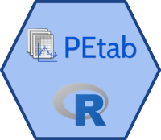

<!-- badges: start -->

<!-- badges: end -->
  

* petab-handling itself, fitting and simulation tool agnostic
    * https://github.com/PEtab-dev/PEtab
    * https://petab.readthedocs.io/
* dMod interface
    * https://github.com/dkaschek/dMod

## Notable functions

Basic functionality for petab handling

* `petab_mutateDCO` - consistently manipulate experimentalCondition, observables and measurementData at once in very expressive data.table language
* `petab_plotData`  - Plot your data with great liberty in customizing the plot, e.g. changing aesthetics and facets and sensible defaults. Supports pagination and asynchronous outputting so you don't wait forever until you can use your R-session again

dMod functionality

* `importPEtabSBML_indiv` - Import PEtab to dMod
* `writePetab` - If the model part is specified in dMod language, the SBML is exported
* `pd_predictAndPlot2` - Simulate and plot your model
    * **ggCallbacks** 
        * Easily customize plot in terms of layers, aesthetics, layout and labels, scales
    * **Asynchronous output**
    * **Quick subsetting**
        * Plot all internal states yes/no
        * Plot all conditions yes/no
        * Plot up to maximum time or match to data
    * **Detailed subsetting**
        * `i`-argument (in data.table parlance) to perform any kind of subset: e.g. subset on `time`, `observableId`, `conditionId` or a combination of them
    * **Observable transformations** on/off
    * **Parameter options**
        * If you have *multistart fits*, you can directly compare different model trajectories at different optima
        * If you have *profiles* or *prediction profiles*, you can use the left and right endpoints of all profiles for predictions which are then summarized to produce *model uncertainty bands* surrounding the prediction at the best fit

# Contributing

Some thoughts on coding-style

* Code is *debugged* more often than it is written (similar to Python's philosophy that code is read more often than it is written). Therefore, code should be *debuggable*
    * Only few calls should span multiple lines (e.g. lapplys), and don't use pipes. Make every step explicit, so people can easily see intermediate results
    * No *large functions* of more than 100 lines, no if statements where you have to scroll to see the closing bracket. All of these can be refactored to use smaller helper functions which improve clarity of the progam's logic and help to debug by being more informative in the traceback.
    * Informative error messages, telling *what* went wrong, instead of telling that *something* went wrong
* Documentation WITH examples is a must
* Declare function imports properly, so functions and their roxygen skeletons can be moved to a different package easily
* Try to use `git commit --amend` and `devtools::document` until the code definitely works before pushing to keep the git log clean
* Reuse the semantics of some flags, e.g. `NFLAGsave = 3` should always mean "check if input files changed, and if not, reload the previously saved version, if it exists"
* Try to program with good taste: https://www.youtube.com/watch?v=o8NPllzkFhE
* Optimally, push to a branch and create PR

# Version history

* New in 0.1.1
    * parameterFormulaInjection in petab$meta 
        * Allows to specify arbitrary parameter transformations after the estimation parameter trafo and before the dynamic model
        * The new prd0 looks like g*x*p1*p0 where p0 is the trafo for est-scales and p1 is the "injected trafo", e.g. a steady state trafo
        * This trafo is the same for all conditions to stay consistent in the indiv-framework

# References 

R logo https://www.r-project.org/logo/ License https://creativecommons.org/licenses/by-sa/4.0/
